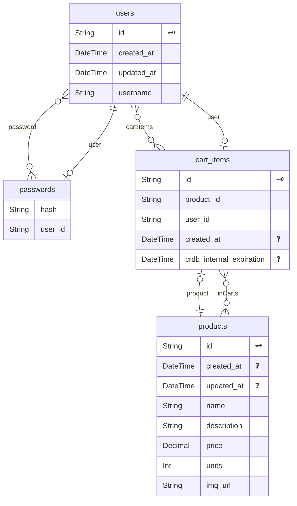

```mermaid
erDiagram

  "users" {
    String id "🗝️"
    DateTime created_at 
    DateTime updated_at 
    String username 
    }
  

  "passwords" {
    String hash 
    String user_id 
    }
  

  "products" {
    String id "🗝️"
    DateTime created_at "❓"
    DateTime updated_at "❓"
    String name 
    String description 
    Decimal price 
    Int units 
    String img_url 
    }
  

  "cart_items" {
    String id "🗝️"
    String product_id 
    String user_id 
    DateTime created_at "❓"
    DateTime crdb_internal_expiration "❓"
    }
  
    "users" o{--}o "passwords" : "password"
    "users" o{--}o "cart_items" : "cartItems"
    "passwords" o|--|| "users" : "user"
    "products" o{--}o "cart_items" : "inCarts"
    "cart_items" o|--|| "products" : "product"
    "cart_items" o|--|| "users" : "user"
```
